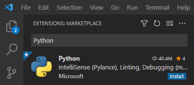

Python and Visual Studio Code
=============================

Visual Studio Code is Microsofts effort to create a platform independent code editor and development environment. The Editor is available for macOS, Windows and Linux. One of the key features of the editor is that it is very flexible and extensible. It supports allmost all programming languages and integrates with source versioning systems such as git. 

For Python development Microsoft provides several plugins that make Visual Studio Code to an excellent environment for Scientific Programming in Python as well as using Python Notebooks. This chapter describes how to setup and configure Visual Studio as a Python development environment.

Installing Visual Studio Code
-----------------------------

Visual Studio code is available from Microsoft at the following location:

`<https://code.visualstudio.com/Download>`_

At this location Visual Studio Code can be downloaded for all platforms. 

The installers are quite self explanatory, so we won't document the steps for installing this on all platforms.

Installing required extensions for Python
-----------------------------------------

To be able to use Python efficiently in Visual Studio Code a couple of extensions are required. The easiest way to install this is to install the Microsoft extensionm, **Python**, which automatically installs the other Microsoft extensions **Pylance** and **Jupyter**.

These extensions are installed directly from within the application by selecting then extension tab on the left side in the application as shown in the following image:

   Extension tab in Visual Studio Code.

To find an extension type the name of the extension in the text box in the top of the tab. More information on the plugin can be found by clicking on the plugin in the list. Installing the plugin is done by clicking on **Install** either directly in the extension list or on the extension information page.

   Installing a Python extension.

The extension information page for the **Python** extension with the install button is shown in the figure below:

   Extension information page.

Click the **install** button to install the required extensions. 

To see the installed extensions. Clear the search box in the extension tab and the installed extensions will be displayed under **INSTALLED**.

   Installed Python extensions.

Creating, saving and opening Python source files
------------------------------------------------

Creating, saving and opening Python source files are done using the normal **New**, **Save** and **Open** item in the file menu. 

When creating a new file in Visual Studio Code it is possible to tell the editor what language you want to use in by clicking on the link **Select a language**. Another alternative is the directly save the file with the extension .py. Visual Studio Code then automatically detects the language and enables Python highlighting and the Python specific extensions.

Activating the Python extension
-------------------------------

The Python extension is activated every time a Python source file is openend in the editor. Status of the extension is displayed in the lower left of the window.

   Extension status information. 

By default the extension status displays shows the default Python interpreter installed on the system. In this case Python 3.7.8 64-bit is the current default interpreter.

Selecting the correct Python interpreter
----------------------------------------

To run Python in Visual Studio code with the extensions installed, the correct Python interpreter must be selected. To change the default Python interpreter click in the extension status information display in the lower left of the window.

   Selecting the default Python interpreter.

Executing a Python source file (.py)
------------------------------------

When a Python source file is open it is possible to execute the file using the currently selected Python interpreter. In the top right there is a button to execute the current source code.

   Executing Python.

Output from the running code is shown in the **Terminal** view in the lower part of the editor window. 

   Output from running code.

Using Visual Studio Code with Anaconda
--------------------------------------

To be able to use the Anaconda distribution fully in Visual Studio Code you should start the editor from a **Anaconda Command Prompt** which is found in the start menu in Windows or Mac. On Linux it works without any special changes. 

In the example below Visual Studio Code is started from the **test** directory. This will instruct the editor to use that directory as the working directory.

.. code-block:: bash

   (base) E:\...>cd test

   (base) E:\...>code .   

